# Lecture 3: Linear time suffix tree construction

## What is covered in this lecture?

Linear-time suffix tree construction

- Ukkonen algorithm (suffix tree construction)

## Introduction

The substring (matching) problem

Given a reference text `txt[1...n]`, preprocess `txt` such that any given
pattern `pat[1...m]` can be searched in linear time proportional to the length
of the pattern, $O(m)$.

- Suffix trees (and similarly suffix arrays) permit solving the above (and many
  other related) problems. They are very versatile.
- Suffix trees unravel the composition of any string, and permit efficient
  access to them.

## String definitions

Given

- A `prefix` of `str[1..n]` is a **substring** `str[1..j]`, $∀1≤j≤n$.
- A `suffix` of `str[1..n]` is a **substring** `str[i..n]`, $∀1≤i≤n$.
- A `substring` of `str[1..n]` is any `str[j..i]`, $∀1≤j≤i≤n$.
- Therefore,
  - A substring is a **prefix of a suffix**
  - (or equivalently) a substring is a **suffix of a prefix**

## Efficient Suffix Tree Construction using `Ukkonen's` algorithm

### Recall from FIT2004:

#### Path compressed suffix tries = suffix trees

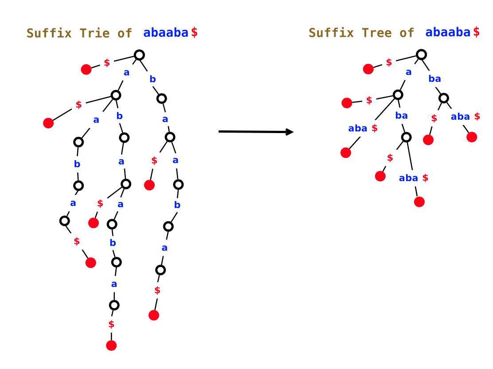

#### Efficient representation of suffix trees requires $O(n)$ space

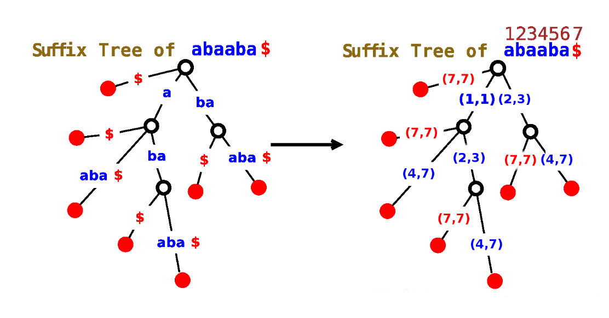

Note, instead of storing the edge labels as substrings **explicitly**, we can
store them **implicitly** using$(j,i)$ denoting the substring `str[j..i]`, where
$1≤j≤i≤n$.

### Building a suffix treenaively

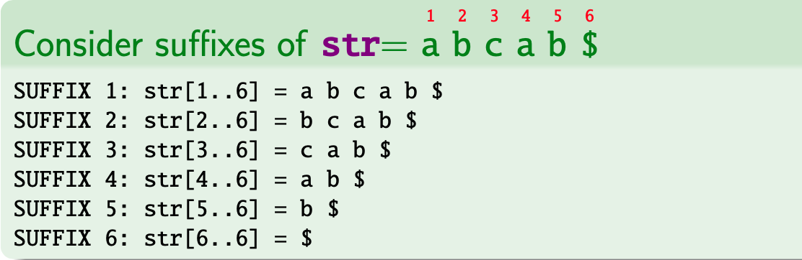

1. Start with the (empty) root node of the suffix tree $r$
2. Insert suffix **1** (`str[1...]1`) into an empty tree.
   - Call the resultant tree $T_1$
3. Insert suffix **2** into $T_1$
   - Note `str[2...]` is not a prefix of `str[1...]`
   - So create a new leaf node for `str[2..]` suffix, branching off at $r$.
   - Call the resultant tree $T_2$
4. Insert suffix **3** into $T_2$
   - Note `str[3..]` is not a prefix of `str[1...]` or `str[2...]`.
   - So create a new leaf node for `str[3]` suffix, again branching of at $r$
   - Call the resultant tree $T_3$
5. Insert suffix **4** into $T_3$
   - Note `str[4..5]` is the longest common prefix shared with the suffix
     `str[1...]`.
   - So, a new node $u$ is inserted
     - Along the edge between $r$ and the leaf node **1**
     - With another edge branching off $u$ to the new leaf node **4**.
   - Call the resultant tree $T_4$
6. Insert suffix **5** into $T_4$
   - Note `str[5..5]` is the longest common prefix shared with the suffix
     `str[2..]`.
   - So a new node $v$ is inserted
     - Along the edge between $r$ and the leaf node **2**
     - With another edge branching out from $v$ to the new leaf node **5**
   - Call the resultant tree $T_5$
7. Insert suffix **6** into $T_5$
   - Note the suffix `str[6..6]` denotes the sepecial terminal character `$`
   - This creates a new isolated edge branching off the root $r$.

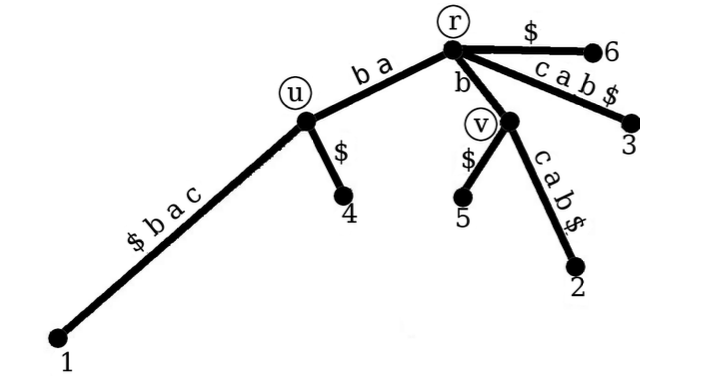

### Ukkonen's linear-time algorithm -- introduction

Ukkonen's algorithm uses the following main ideas:

1. Construct and use an '`implicit suffix tree`' data structure
   - The actual suffix tree is computed after iteratively constructing (over
     many phases) an implicit suffix tree.
2. Enhance this `implicit suffix tree` using '`suffix links`'.
   - This helps make the traversals on the implicit tree much faster.
3. Gain from a set of implementational '**tricks**':
   - These tricks avoid unnecessary computations, thus speeding up the algorithm
     drastically.

### Implicit suffix trees

The relationship between an implicit suffix tree and its regular suffix tree can
be understood by the following operations on the regular suffix tree:

- Start with a regular suffix tree (of `str = a b c a b`).
- Remove all terminal (`$`) characters in the regular suffix tree.
- Then, remove all edges without edge labels (i.e. substrings)
- Then, path compress the tree by removing all nodes that do not have at least
  two children.
  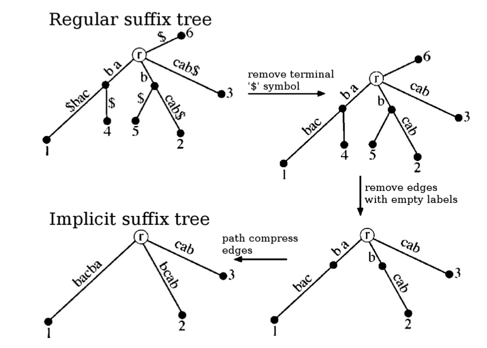

### Ukkonen's algorithm builds implicit suffix trees incrementally in `phases`

Given a string `str[1..n]`, Ukkonen's algorithm proceeds over $n$ "`phases`"

- Each `phase` $i+1$ (where $1≤i+1≤n$) builds the `implict` suffix tree (denoted
  by `implicitST`$_{i+1}$) for the **prefix** `str[1..i+1]`.
- Importantly, each `implicitST`${_i+1}$ is incrementally computed using the
  `implicitST`$_i$ from the previous phase.
  - The construction of `implicitST`$_{i+1}$ from `implicitST`$_i$, in turn
    involves several `suffix extension` steps, one for each suffix of the form
    `str[j..i+1]`, where $j=1…i+1$ in that order.

### Each phase involves suffix extensions

- In any phase $i+1$, the suffixes in `implicitST`$_i$ (from the previous phase
  $i$) undergo `suffix extensions` to accommondate the **additional character**
  , `str[i+1]`.
- Thus, extending any suffix $j$, where $1 <= j <= i + 1$, in the current phase
  $i+1$ involves:
  - Finding the path from the root node $r$ corresponding to the suffix
    `str[j...i]`, and
  - Extending `str[j..i]` by appending `str[i+1]` to the suffix.

### Algorithm at a very high level

```
Construct implicitST1
For i from 1 to n-1
  Begin PHASSE i + 1
    For j from 1 to i + 1
      Begin SUFFIX EXTENSION j
      - Find end of path from root denoting str[j..i] in the current state of the suffix tree.
      - Apply one of the three suffix extension rules.
    End of extension step j
  End of phase i + 1 (implicitSTi+1 computed)
```

### Suffix extension rules

#### Rule 1 of 3

If the path `str[j..i]` in `implicitST`$_i$ **ends at a leaf**, adjust the
**label of the edge** to that leaft to account for the added character
`str[i+1]`.

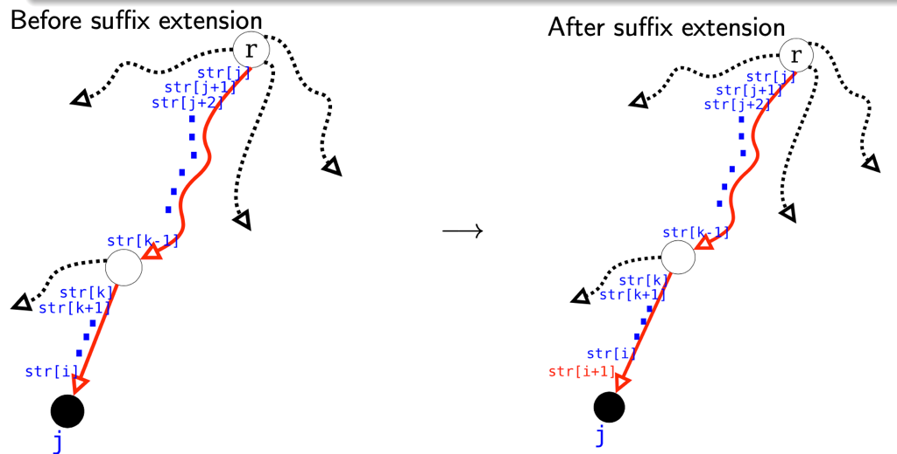

#### Rule 2 of 3

If the path `str[j..i]` in `implicitST`$_i$ **does NOT** end at a leaf, and the
next chracter in the existing path is some $x ≠$ `str[i+1]`, then split the ege
after `str[..i]` and create a new node $u$, followed by a new leaf numbered $j$;
assign character `str[i+1]` as the edge label betwene the new node $u$ and leaf
$j$.

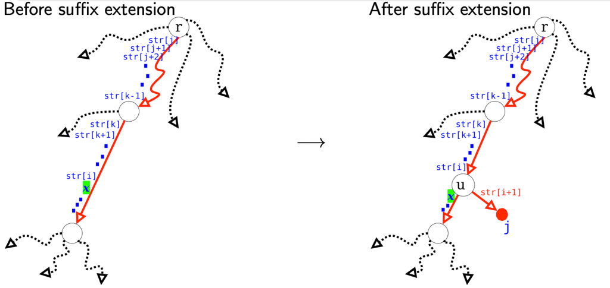

#### Rule 2 of 3 - an alternative scenario that can arise

If the path `str[j..i]` in `implicitST`$_i$ **does NOT** end at a leaf, and the
next chracter in the existing path is some $x ≠$ `str[i+1]`, **and `str[i]` and
$x$ are separated by an existing node $u$** ,then split the ege after `str[..i]`
and create a new node $u$, followed by a new leaf numbered $j$; assign character
`str[i+1]` as the edge label betwene the new node $u$ and leaf $j$.

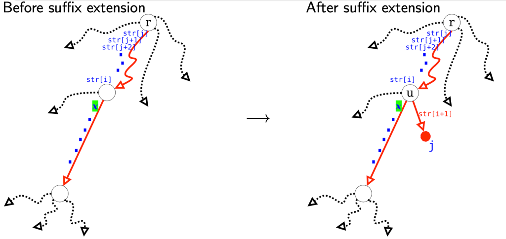

#### Rule 3 of 3

If the path `str[j..i]` in `implicitST`$_i$ **does NOT** end at a leaf, but is
within some edge label, and the next character in that path is `str[i+1]`, then
`str[i+1]` is already in the tree. **No further action needed**.

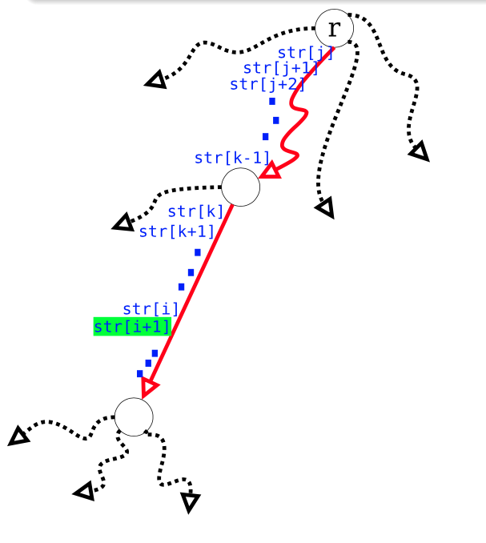

#### Example

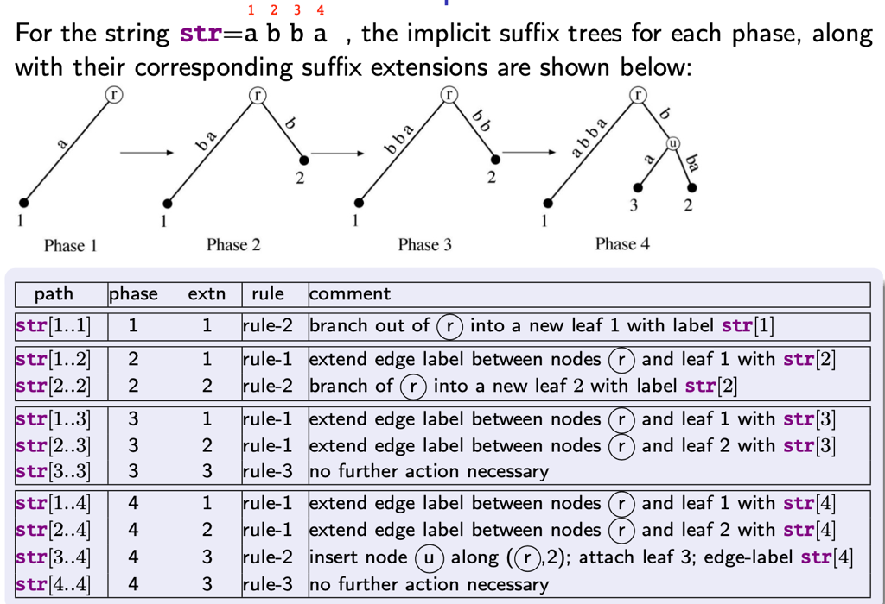

### Speeding up tree traversal usingsuffix links

Suffix links are simply `pointers` between internal nodes of an (implicit)
suffix tree, that speed up traversal time in each phase.

#### Definition of a suffix link

- Let $u$ and $v$ be two internal nodes of an implicit suffix tree.
- Let the traversal from root node $r$ to $u$ yield some substring
  `str[j..k-1]`.
- Let the traversal from root node $r$ to $v$ yield a substring `str[j+1..k-1]`.
- Then the pointer from $u$ to $v$ defines a suffix link between those nodes.

#### Example

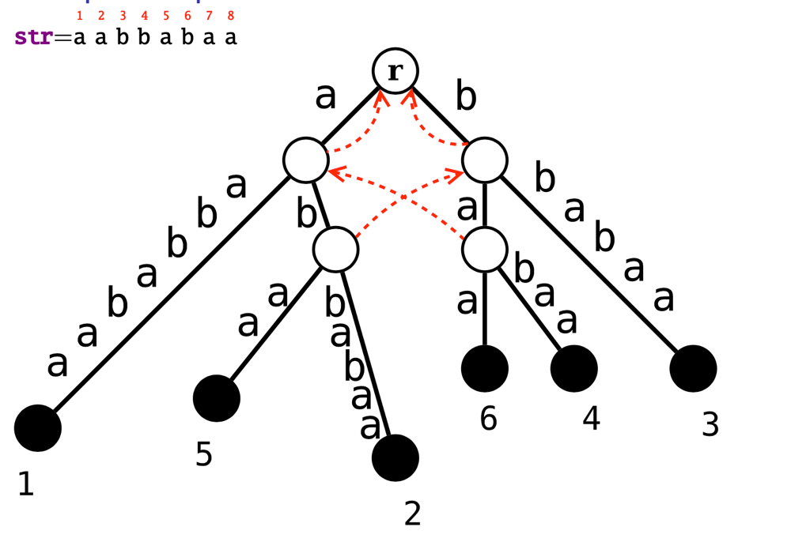

### KEY OBSERVATION:

Every internal node of an implicit suffix tree has a suffix link **from** it.

- If, in some suffix extension $j$ of phase $i+1$, a new internal node $u$ is
  added to the current state of the implict suffix tree.
  - i.e., rule **2** of the suffix extension rules is applicable here.
- This means before $u$ is added, the path `str[j..i]` is continued by a
  character (say $x$), where $x \ne$ `str[i+1]`.
- This implies, in the next suffix extension $j+1$ of the same phase $i+1$:
  - **Either** the path `str[j+1..i]` continues **ONLY VIA** character $x$.
    - Which implies, a **new** internal node $v$ must be added, after
      `str[j+1..i]`, that brances to the new leaf $j+1$ via character `str[i+1]`
  - **Or** the path `str[j+1..i]` already ends in an **existing** internal node
    $v$
    - With one branch below extending via character $x$
    - And one (or more) branch(es), via character(s) $\ne$ `str[i+1]`
  - Thus, new suffix link $u$ to $v$ **WILL BE created** in $j+1$ extension.

### Following the trail of suffix links to build `implicitST`$_{i+1}$ from `implicitST`$_i$

Recall that in the extension $j$ of phase $i+1$ the algorithm locates suffix
`str[j..i]`, and extends it by `str[i+1]`, for each $j$ increasing from 1 to
$i+1$. Suffix links are used to speed these extensions.

#### Extension 1, phase

- This first suffix represents the full prefix `str[1..i+1]` considered in this
  phase.
- We have to locate first the suffix `str[1..i]`.
- Note, suffix `str[1..i]` is the longest string represented in the implict
  suffix `implicitST`$_i$ (from which `implicitST`$_{i + 1}$ is being computed).
- Let `ptr` be a pointer to the leaf containing `str[1..i]` in `implicitST`$_i$.
- Given `ptr`, the extension from to `str[1..i]` can be handled in constant
  time.

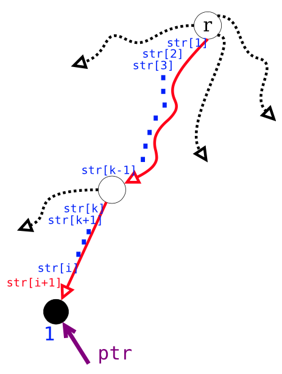

#### Extension 2, phase

- Consider the edge ending at leaf 1 (after extension 1).
- Let $u$ be the internal node forming the edge with leaf 1.
- Let the substring corresponding to that edge be `str[k..i+1]`.
- In this extension, to find `str[2..i]` (and extend to `str[2..i+1]`):
  - Walk up EXACTLY ONE EDGE from leaf 1 to $u$.
  - From $u$, follows its suffix link to $v$.
  - From $v$, walk down along the path `str[k..i]`
  - Then apply the pertinent suffix extension rule, by walking down fromvand
    then appending `str[i+1]`.

### General extension procedure for phase

For any extension $j \ge 2$ of phase $i+1$ repeats the same general idea

1. Find the first node $u$ **AT OR ABOVE** the end of `str[j-1..i]`.
   - i.e., backtracking **AT MOST one edge** from the end of `str[j-1..i]`.
   - Let the substring `str[k..i]` (possibily empty) denote the edge label
     between $u$ and end of `str[j-1..i]`.
2. If $u≠r$, traverse the suffix link from $u$ to $v$. Walk down from $v$ along
   the path dictated by the substring `str[k..i]`. \* On the other hand, if
   $u=r$, then no choice but to naively follow traverse the path from from $r$.
3. Once at the desired point (i.e., end of `str[j..i]`), apply pertinent suffix
   extension rules.
4. Repeat items 1-3 above until each suffix `str[j..i+1]` (of the prefix
   `str[1..i+1]`), for $1≤j≤i+1$ is `implicitST`$_{i+1}$.
5. During these extensions, any new internal nodeucreated in extension $j-1$,
   gets its suffix link to it corresponding node $v$ in the next extension $j$.

## Implementational trick 1 - skip/count trick

In item 2 (above), during extension $j$, the extension requires you to walk down
form node $v$, along the path `str[k..i]`. Instead of a character-by-character
comparision while walking down from $v$, one could speed up the traversal by
skipping over the nodes below $v$, while keeping track of the total substring
length skipped along the path until the right location is reached.

- Let `str[k..i] = z a b c d e f h h y`
- From node $v$, ask how many characters representing the edge starting with
  $z...$. Here 2.
- Since $10 > 2$, skip to the node receiving that edge.
- In `str[k..i]`, the 3rd $(3 = 2+1)$ character is $b$.
- Again, ask how many characters representing the edge starting with `b...`
  Again it is 2.
- Since $10 > 2 + 2$, skip to the node receiving the edge.
- From `str[k..i]`, the 5th $(5 = 2+2+1)$ chracter is d.
- Again, ask how many characters representing the edge starting with `d...`. It
  is 3.
- Since $10 > 2 + 2 + 3$, skip to the node receieving that edge.
- ... and so on until the node beyond which furhter skips are not
  possible/necessary.

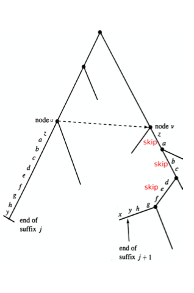

## Implementational trick 2 - space-efficient representation of edge-labels/substrings
